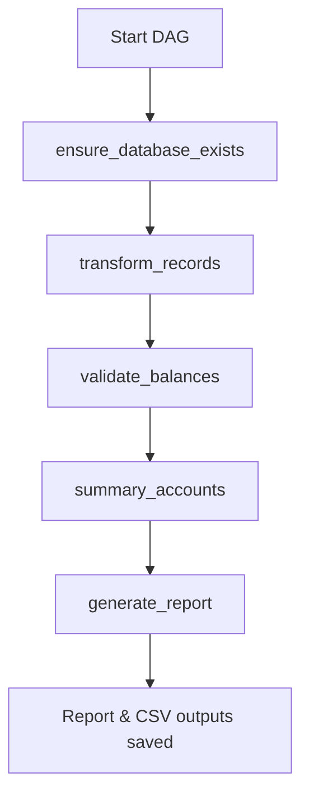

# DATA_ENGINEEREAPPI

### Proyecto de Migración, Transformación y Validación de Datos con Apache Airflow y SQLite

Este proyecto implementa un flujo **ETL (Extract, Transform, Load)** usando **Apache Airflow** en contenedores **Docker**, con base en datos locales en formato CSV y una base de datos **SQLite** como referencia.  
Permite automatizar la creación de la base de datos, la transformación de registros contables, la validación de saldos y la generación de reportes de calidad de datos.

---

## Estructura del Proyecto

```
DATA_ENGINEEREAPPI/
│
├── dags/
│   └── data_migration_dag.py        # Definición del DAG principal de Airflow
│
├── data/
│   ├── processed/                   # Resultados procesados por el DAG
│   │   ├── account_summary.csv
│   │   ├── invalid_transactions.csv
│   │   ├── transformed.csv
│   │   └── report.txt               # Reporte final generado automáticamente
│   └── reference/                   # Datos base de entrada
│       ├── accounts.csv
│       ├── journal_entries.csv
│       └── local.db
│
├── logs/                            # Logs generados por Airflow
├── plugins/                         # Carpeta reservada para plugins personalizados
│
├── src/
│   ├── connection/
│   │   ├── data_base.py             # Crea la base local desde los CSV
│   │   └── sql_engine.py            # Maneja la conexión y operaciones con SQLite
│   │
│   ├── constants/
│   │   ├── paths.py                 # Control de rutas
│   │   └── queries.py               # Consultas SQL base del proceso ETL
│   │
│   └── work_flows/
│       └── data_migration_flow.py   # Lógica ETL: transformación, validación y reporte
│
├── .env                             # Variables de entorno para Airflow
├── docker-compose.yaml              # Orquestación de contenedores
├── requirements.txt                 # Dependencias del entorno
└── README.md                        # Documentación del proyecto
```

---

## Funcionalidad del DAG `data_migration_dag.py`

El DAG **`data_migration_dag`** define un flujo completo de validación de datos:

1. **ensure_database_exists** 
   Crea la base de datos `local.db` si no existe, cargando los CSV de referencia.

2. **transform_records** 
   Ejecuta la transformación de datos contables (JOIN + normalización) y guarda el resultado en `transformed.csv`.

3. **validate_balances** 
   Detecta transacciones con desbalances (débito ≠ crédito) y guarda los resultados en `validation.csv`.

4. **summary_accounts** 
   Genera un resumen agregado por cuenta contable.

5. **generate_report** 
   Filtra las transacciones válidas (`is_valid_transaction == 1`), elimina la columna de validación y genera el reporte final `report.txt`.  
   Si el porcentaje de registros inválidos supera el 5%, el DAG lanza una excepción para marcar fallo de calidad.

---

## Despliegue con Docker + Airflow

El proyecto está completamente **contenedorizado**, utilizando tres servicios principales definidos en `docker-compose.yaml`:

| Servicio              | Función principal |
|------------------------|------------------|
| **airflow-postgres**   | Base de datos de metadatos para Airflow |
| **airflow-webserver**  | Interfaz web accesible desde `localhost:8080` |
| **airflow-scheduler**  | Ejecuta y programa las tareas del DAG |
| **airflow-init**       | Inicializa la base de datos de Airflow y crea el usuario admin |

---

## Pasos para la Ejecución

### Clonar el repositorio
```bash
git clone https://github.com/<usuario>/DATA_ENGINEEREAPPI.git
cd DATA_ENGINEEREAPPI
```

### Requisitos Previos

1. **Docker y Docker Compose** instalados en el sistema.
2. **Python 3.11 o 3.12** si se desea ejecutar las funciones fuera de contenedor.
3. Acceso a PowerShell o terminal equivalente.

---

### Configuración del Entorno Docker

El archivo `docker-compose.yaml` define los servicios necesarios para ejecutar Apache Airflow de manera local.  
Los servicios principales son:

- **airflow-webserver:** Interfaz web de Airflow (puerto 8080).
- **airflow-scheduler:** Programa que gestiona la ejecución del DAG.
- **airflow-postgres:** Base de datos que almacena la configuración y el historial de Airflow.

### Contenido del `docker-compose.yaml` (resumen)

```yaml
services:
  airflow-webserver:
    image: apache/airflow:2.6.3
    ports:
      - "8080:8080"
  airflow-scheduler:
    image: apache/airflow:2.6.3
  airflow-postgres:
    image: postgres:13
    healthcheck:
      test: ["CMD-SHELL", "pg_isready -U postgres"]
```

---

## Instrucciones de Ejecución

Asegúrate de abrir **PowerShell** y ubicarte en la carpeta raíz del proyecto.  
Por ejemplo:

```bash
cd "D:\Pruebas tecnicas\data_engineer_rappi\Data_EngineerRappi"
```

Luego, sigue los pasos en orden:

### 1. Descargar las imágenes necesarias
```bash
docker compose pull
```

### 2. Crear y ejecutar el contenedor principal
```bash
docker compose up airflow-webserver --force-recreate --no-deps -d
```

### 3. Detener y eliminar volúmenes anteriores
```bash
docker compose down --volumes --remove-orphans
```

### 4. Iniciar el servicio de base de datos (Postgres)
```bash
docker compose up -d airflow-postgres
```

### 5. Inicializar la base de datos interna de Airflow
```bash
docker compose run airflow-webserver airflow db init
```

### 6. Levantar todos los servicios
```bash
docker compose up -d
```

### 7. Verificar que los contenedores estén activos
```bash
docker compose ps
```

## Crear y configurar las variables de entorno
Edita el archivo `.env` con tus datos si es necesario:
```bash
_AIRFLOW_WWW_USER_USERNAME=admin
_AIRFLOW_WWW_USER_PASSWORD=admin
```

## Acceder a la interfaz de Airflow
Abre el navegador en:

```
http://localhost:8080
```

Usuario: **airflow**  
Contraseña: **airflow**

---

## 🪶 Ejecución del DAG

1. En la interfaz de Airflow, busca el DAG llamado **`data_migration_dag`**.  
2. Actívalo moviendo el switch a **ON**.  
3. Haz clic en el botón ▶️ **Trigger DAG** para ejecutarlo.  
4. Observa el flujo en el **Graph View** o revisa los logs de cada tarea.

---

## Salidas del Proceso

Una vez completado el flujo, los archivos resultantes estarán en:

```
data/processed/
```

| Archivo | Descripción |
|----------|-------------|
| `transformed.csv` | Datos transformados con validación de campos |
| `validation.csv`  | Transacciones con desbalances |
| `summary.csv`     | Resumen agregado por cuenta |
| `report.txt`      | Reporte final de calidad de datos |

## Ejemplo de contenido del `report.txt`
```
=== Data Migration Valid Transactions Report ===

Total records processed: 245
Valid records after filtering: 240
Invalid percentage: 2.04%

=== Transformed Transactions ===
transaction_id  transaction_date  account_number  account_name  debit_amount  credit_amount
1               2024-01-10        1001            Caja          500.00        0.00
...

=== Validation Transactions ===
transaction_id  total_debits  total_credits
102             1500.00       0.00
...
```

---

## Dependencias Principales

- **Python 3.10+**
- **Apache Airflow 2.6.3**
- **Pandas**
- **SQLite3**
- **PostgreSQL 13 (para Airflow metastore)**
- **Docker y Docker Compose**

Instalación local (opcional, fuera del contenedor):
```bash
pip install -r requirements.txt
```

---

## Variables de Entorno Importantes

Definidas en `.env`:

| Variable | Descripción |
|-----------|-------------|
| `_AIRFLOW_WWW_USER_USERNAME` | Usuario del panel web |
| `_AIRFLOW_WWW_USER_PASSWORD` | Contraseña del usuario |
| `_AIRFLOW_WWW_USER_EMAIL` | Correo asociado |
| `PROJECT_HOME` | Directorio raíz de Airflow dentro del contenedor |
| `PYTHONPATH` | Rutas a módulos fuente |

---

## Flujo de Lógica (Resumen)



---

## Mantenimiento y Extensión

- Puedes añadir nuevos DAGs en la carpeta `dags/`.
- Los scripts del flujo principal se ubican en `src/work_flows/`.
- Si cambias los nombres de las tablas o CSV, ajusta las consultas SQL en `src/constants/queries.py`.
- Los logs de ejecución se encuentran en la carpeta `logs/`.

---

## Autor

**Miguel Triana**  
Ingeniero Mecatrónico | Especialista en Gerencia Financiera  
Automatización, Python, SQL y Ciencia de Datos  
📧 samuellulu200021@gmail.com  
🌐 [LinkedIn](https://www.linkedin.com/in/miguel-triana-993b0925a/)
